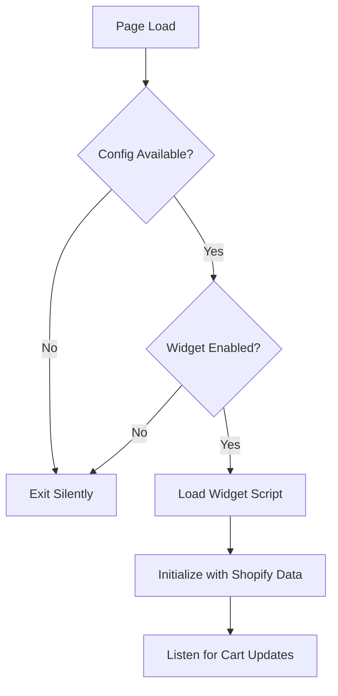

# Shopify App Embed Extension Setup

## Overview

The ChatPop App Embed extension enables automatic widget installation for Shopify merchants. Merchants can enable the widget with a single toggle in their theme settings - no code editing required.

## Architecture

### Extension Structure
```
extensions/chat-widget-embed/
├── shopify.extension.toml     # Extension configuration
├── blocks/
│   └── app-embed.liquid        # App embed block
├── snippets/
│   └── chatpop-config.liquid   # Widget configuration
├── assets/
│   └── widget-loader.js        # Widget loader script
└── locales/
    └── en.default.json         # Translations
```

## How It Works

1. **Installation**: When a merchant installs the app via OAuth, the agent_id is stored in shop metafields
2. **Theme Editor**: Merchant navigates to Theme Settings → App Embeds
3. **Enable Widget**: Merchant toggles "ChatPop Widget" on
4. **Automatic Loading**: Widget loads on all pages of the store

## Widget Loader Flow



## Development Setup

### Prerequisites
- Shopify CLI installed: `npm install -g @shopify/cli @shopify/app`
- Shopify Partner account
- Development store

### Local Testing

1. **Link Extension to App**
```bash
cd extensions/chat-widget-embed
shopify app dev
```

2. **Access Preview**
- CLI will provide a URL to preview the extension
- Open in browser and authorize the dev store

3. **Test in Theme Editor**
- Go to your dev store admin
- Navigate to Online Store → Themes → Customize
- Open Theme Settings → App Embeds
- Enable "ChatPop Widget"

### Deployment

1. **Deploy Extension**
```bash
shopify app deploy
```

2. **Submit for Review**
- Go to Shopify Partners Dashboard
- Navigate to your app
- Submit the extension for review

## OAuth Flow Updates

After successful OAuth connection, the callback now:
1. Stores the agent_id in shop metafields
2. Sets the widget base URL in shop metafields
3. Shows success message with link to theme editor

## Merchant Installation Guide

### For Merchants

1. **Install the App**
   - Go to Shopify App Store
   - Search for "ChatPop"
   - Click "Install"

2. **Configure Agent**
   - Complete the onboarding wizard
   - Customize your AI assistant

3. **Enable Widget**
   - Go to Online Store → Themes → Customize
   - Click "Theme Settings" (bottom left)
   - Scroll to "App Embeds"
   - Toggle "ChatPop Widget" ON
   - Click "Save"

4. **Verify Installation**
   - Visit your store
   - Widget should appear in bottom-right corner

### Troubleshooting

**Widget not appearing?**
- Check App Embeds is enabled in Theme Settings
- Verify agent_id is set in App Dashboard
- Check browser console for errors
- Ensure theme is published

**Widget loading slowly?**
- Normal on first load (script caching)
- Subsequent loads should be instant

## Manual Embed Fallback

For custom themes or advanced use cases, merchants can still manually embed the widget:

```html
<script>
  window.ChatPopConfig = {
    agentId: 'YOUR_AGENT_ID',
    shopDomain: '{{ shop.domain }}',
    enabled: true
  };
</script>
<script src="{{ 'widget-loader.js' | asset_url }}"></script>
```

Add this snippet before `</body>` in `theme.liquid`.

## Metafields Schema

The app uses the following shop metafields:

| Namespace | Key | Type | Description |
|-----------|-----|------|-------------|
| chatpop | agent_id | string | The agent UUID |
| chatpop | widget_url | string | Widget base URL (default: production) |

## Benefits

✅ **Zero-code Installation**: Merchants just toggle on/off  
✅ **App Store Compliant**: Meets Shopify requirements  
✅ **Better UX**: No technical knowledge required  
✅ **Automatic Updates**: Widget updates without theme changes  
✅ **Theme Compatible**: Works with all Shopify themes  

## Next Steps

- [ ] Test on multiple themes
- [ ] Add widget position customization
- [ ] Support for multiple languages
- [ ] Analytics for widget engagement
